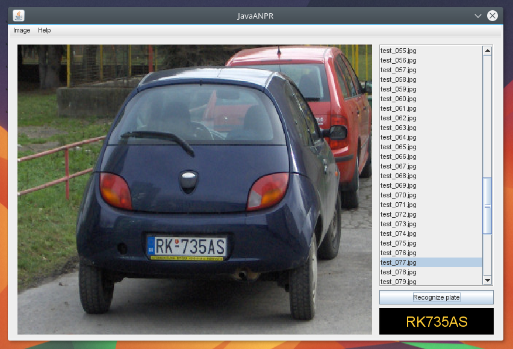

== JavaANPR

image:https://travis-ci.org/oskopek/javaanpr.svg?branch=master["Build Status", link="https://travis-ci.org/oskopek/javaanpr"]
image:https://coveralls.io/repos/oskopek/javaanpr/badge.png?branch=master["Coverage Status", link="https://coveralls.io/r/oskopek/javaanpr?branch=master"]
image:https://www.ohloh.net/p/javaanpr/widgets/project_thin_badge.gif["Ohloh widget", link="https://www.ohloh.net/p/javaanpr"]

*Original author*: Copyright (C) 2006-2007 Ondrej Martinsky. All rights reserved.

Licensing details for JavaANPR are in the file LICENCE.

This work is a derivative of JavaANPR created by Ondrej Martinsky, for his original work visit: http://javaanpr.sourceforge.net/

=== Screenshot

=== Building

* *Recommended*: `mvn clean install -DskipTests`
* To run *unit tests*: `mvn clean test`
* To run *functional tests* too: `mvn clean verify -Pit`
* To *clean*, run: `mvn clean`
* To run the *example GUI*: `mvn exec:java`

=== Getting help

* Post questions or comments on our Google Groups link:https://groups.google.com/d/forum/javaanpr[mailing list]
* Join our *IRC channel*: Join *#javaanpr* on *irc.freenode.net*

=== Info

JavaANPR uses http://semver.org/[semantic versioning].

== Documentation
The state of documentation of JavaANPR is unsatisfactory.
The bachelor thesis of the original author can serve very well for current needs:
http://javaanpr.sourceforge.net/anpr.pdf[Algorithmic and Mathematical Principles of Automatic Number Plate Recognition Systems]

=== Contributing
*Everyone* is encouraged to help improve this project.

Here are some ways *you* can contribute:

* by using alpha, beta, and pre-release versions
* by reporting bugs
* by suggesting new features
* by translating to a new language
* by writing or editing documentation
* by writing specifications
* by writing code (*no patch is too small*: fix typos, add comments, clean up inconsistent whitespace)
* by refactoring code
* by closing https://github.com/oskopek/javaanpr/issues[issues]
* by reviewing patches

=== Submitting an Issue
We use the https://github.com/oskopek/javaanpr/issues[GitHub issue tracker] to track bugs and features. Before
submitting a bug report or feature request, check to make sure it hasn't
already been submitted. When submitting a bug report, please include a https://gist.github.com/[Gist]
that includes a stack trace and any details that may be necessary to reproduce
the bug, including your Java version and operating system.

=== Submitting a Pull Request
1. http://help.github.com/fork-a-repo/[Fork the repository.]
2. http://learn.github.com/p/branching.html[Create a topic branch.]
3. Implement your feature or bug fix.
4. Run +mvn clean install+. If the tests fail, return to step 3.
5. If applicable, add tests for your feature or bug fix.
6. Add, commit, and push your changes.
7. http://help.github.com/send-pull-requests/[Submit a pull request.]
